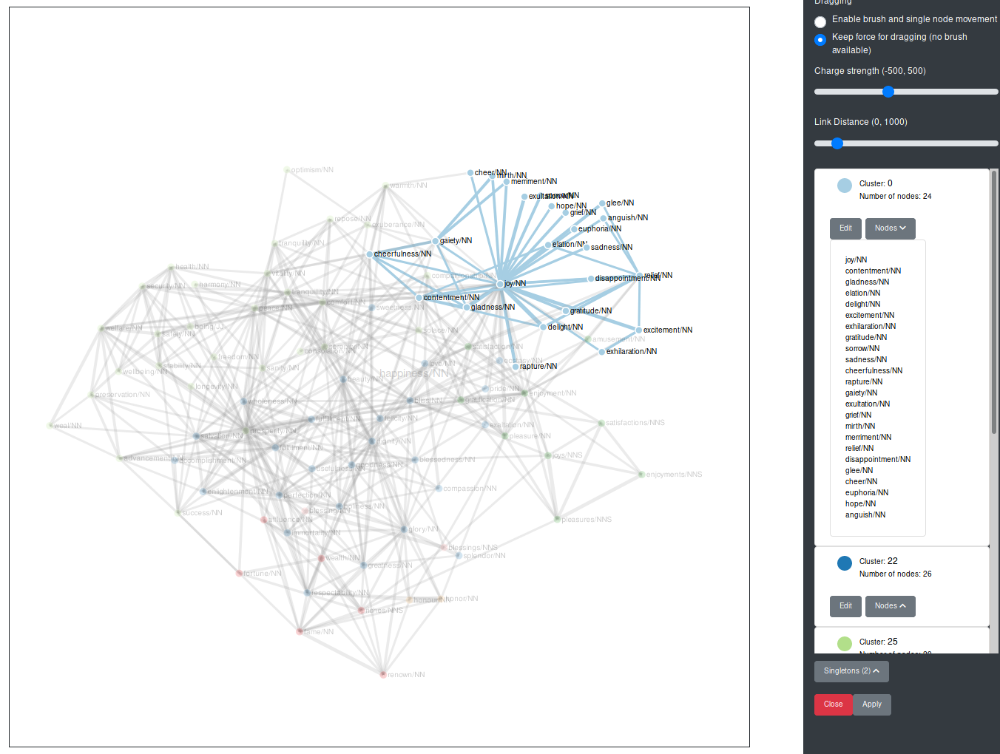
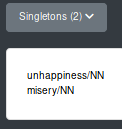
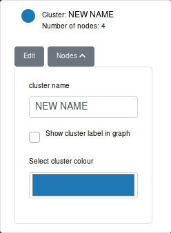
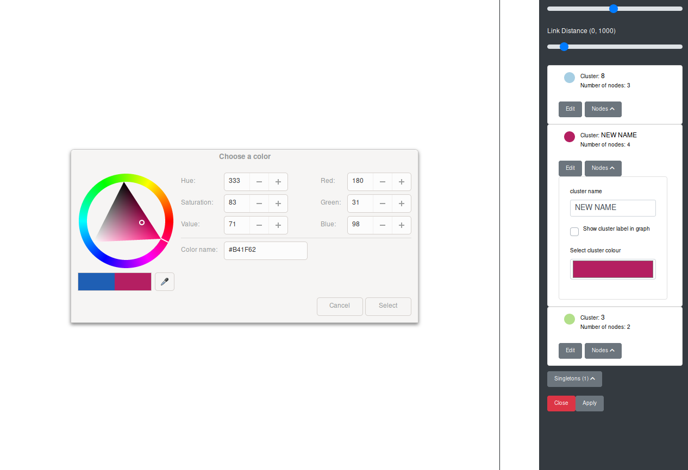
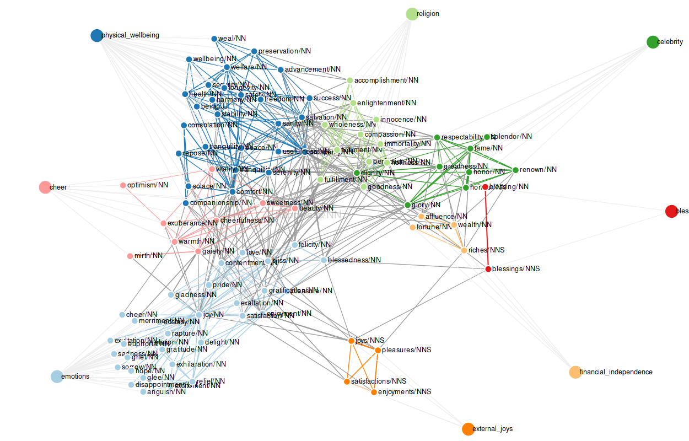
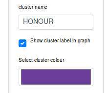

# Edit Clusters
The clusters produced by the program can be edited and if necessary corrected. In the edit column all the clusters in the graph are listed. For each cluster there are to buttons: one to edit the cluster and another to display a list of all the nodes in the respective cluster.

When hovering over the coloured circle next to the cluster name, all the nodes and edges in the graph belonging to the cluster are faded in in the graph.

In some cases, nodes are not connected to any other in the graph. The are only neighbours to the target word. Then, the nodes are not rendered in the graph, but they are listed under "Singletons" in the edit column.

## Edit Cluster Name
The program only numbers the clusters and it is up to the user to name the cluster. A cluster name can be changed via the edit button of a cluster.

The user can enter the new name in the text input field "Cluster Name". The name of the cluster is automatically updated while typing.

## Edit Cluster Colour
The user can also select a different cluster colour by clicking on the colour field with the label "Select cluster colour" when editing a cluster. Then a colour picker opens and the user can select the new colour.

Your colour picker may look different to the one in the image, since the appearance of the colour picker depends on your browser.

The colour of the circle next to the cluster name is directly updated. However, to apply the new colour to the graph, the user needs to click on the button "Apply" at the bottom of the edit column.

The user can edit multiple clusters before clicking the "Apply" button to make the updated visible in the graph.

## Add / Delete Cluster Node
The user can also add a special node with the cluster name to the graph for each cluster - sort of like a label to a cluster. This node has edges to all the other nodes in the cluster.

To add a new cluster label, the user ticks the box "Show cluster label in graph" when editing a cluster and clicks the "Apply" button at the bottom of the edit column.

For each cluster only one cluster node can be added.

When reclustering the graph, the old labels are kept in the graph. Since the reclustering produced new clusters on the graph, the user can add new cluster labels. The old labels are kept, so that the clusters can be more easily compared. When hovering over a cluster node, all the nodes connected to it (i.e. all the nodes in the cluster) are faded in.

The same behaviour is displayed when updating the graph.

Cluster labels can be deleted via selecting them (clicking on them) and then pressing `BACKSPACE`.

**Note of caution:** Currently, selected cluster nodes are always deleted when pressing `BACKSPACE`. This is not ideal, I know, and I am going to solve this. However, until I do, please make sure you have selected a non-cluster node when editing e.g. a cluster name. Otherwise, you might accidentally delete a cluster node.

## Assign a Node to a Different Cluster
In case the user does not agree with the system hypothesis, he or she can assign a node to a different existing cluster.
When clicking on a node, an "Options" button appears in the corner above the graph.

A click on this buttons opens a dropdown menu. Currently, the only option available is "Assign to different cluster". After selecting this option, a modal is opened, in which the selected node, its current cluster and an input field in which the user can enter the new cluster of the node.

On clicking "OK", the node's colour changes to the one of the newly assigned cluster. It also changes the cluster in the cluster list.

If a cluster labels are used, they do not automatically update, but have to be deleted manually and reentered with the updated clusters via the edit function of the respective cluster.