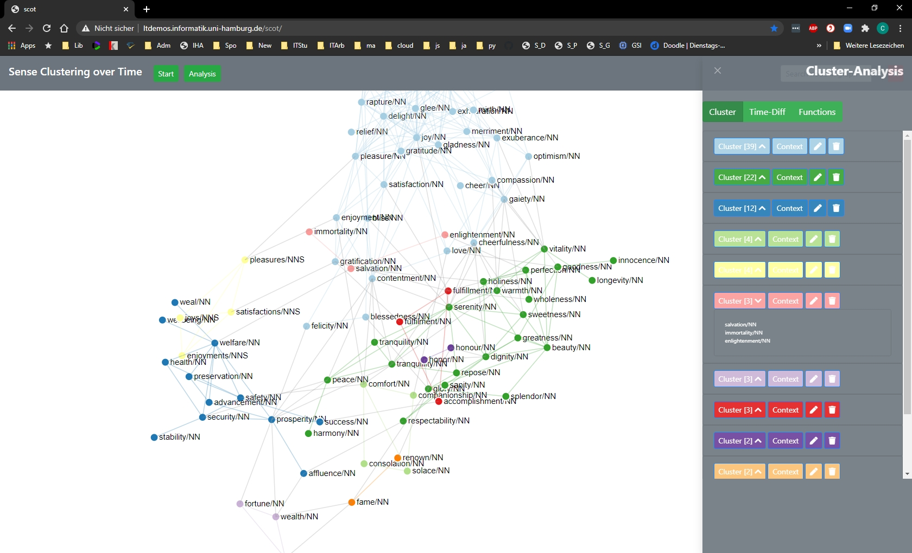

# Cluster-Analysis-Menu

[Back to user guide contents list](userGuide.md)

After clicking the Analysis - Button on the Navigation-Bar, the user is presented with an analysis-menu on the right-hand side of the screen. The Cluster-Setting brings up a  list of the clusters for further analysis and editing.

## Contents

* [Editing the Clusters](#editing-the-clusters)
* [Edit Cluster Name](#edit-cluster-name)
* [Edit Cluster Colour](#edit-cluster-colour)
* [Add Cluster Node](#add-cluster-node)
* [Delete Cluster Node](#delete-cluster-node)
* [Delete Complete Cluster](#delete-complete-cluster)

[To the top](#editing-the-graph-via-the-functions-of-the-editing-sidebar)

## Editing the Clusters

In the edit column all the clusters in the graph are listed. For each cluster there are four buttons: one to show the nodes of the cluster, one to show the context-words that are shared by all nodes of the cluster, one to edit the cluster and another to delete the cluster.

When hovering over the cluster and context buttons, all the nodes and edges in the graph belonging to the cluster are faded in in the graph.

In some cases, nodes are not connected to any other in the graph. They are only neighbours of the target word. Then, the nodes are not rendered in the graph, but they are listed under "Singletons" in the edit column.

## Edit Cluster Name

The program only numbers the clusters and it is up to the user to name the cluster. A cluster name can be changed via the edit button of a cluster.

{:height="40%" width="40%"}

The user can enter the new name in the text input field "cluster name". The name of the cluster is automatically updated while typing.

[To the top](#editing-the-graph-via-the-functions-of-the-editing-sidebar)

## Edit Cluster Colour

The user can also select a different cluster colour by clicking on the colour field with the label "Select cluster colour" when editing a cluster. Then a colour picker opens and the user can select the new colour.

Your colour picker may look different to the one in the image, since the appearance of the colour picker depends on your browser.

The colour of the circle next to the cluster name is directly updated. However, to apply the new colour to the graph, the user needs to click on the button "Apply" at the bottom of the edit column.

The user can edit multiple clusters before clicking the "Apply" button to make the updated visible in the graph.

[To the top](#editing-the-graph-via-the-functions-of-the-editing-sidebar)

## Delete Complete Cluster

Complete cluster can be deleted via the button with the trash icon. The user then has to confirm the deletion in a confirmation message. When the user confirms all the nodes and links of the cluster are deleted.

{:height="75%" width="75%"}

## Add Cluster Node [currently under revision - not enabled]

The user can also add a special node with the cluster name to the graph for each cluster - sort of like a label for a cluster. This node has edges to all the other nodes in the cluster.

To add a new cluster label, the user ticks the box "Show cluster label in graph" when editing a cluster and clicks the "Apply" button at the bottom of the edit column.

For each cluster only one cluster node can be added.

When reclustering the graph, the old labels are kept in the graph. Since the reclustering produces new clusters on the graph, the user can add new cluster labels. The old labels are kept, so that the clusters can be more easily compared. When hovering over a cluster node, all the nodes connected to it (i.e. all the nodes in the cluster) are faded in.

The same behaviour is displayed when updating the graph.

[To the top](#editing-the-graph-via-the-functions-of-the-editing-sidebar)

## Delete Cluster Node

In case the user wants to get rid of the cluster node of a cluster, they have two possibilities. Both are explained in [the section on interacting with the graph](interacting.md).

[To the top](#editing-the-graph-via-the-functions-of-the-editing-sidebar)

[To the top](#editing-the-graph-via-the-functions-of-the-editing-sidebar)