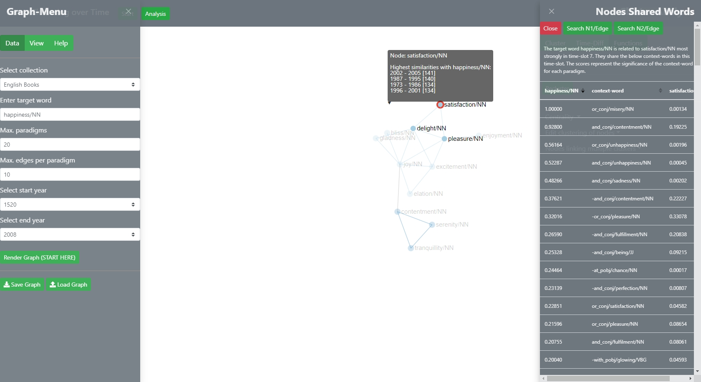
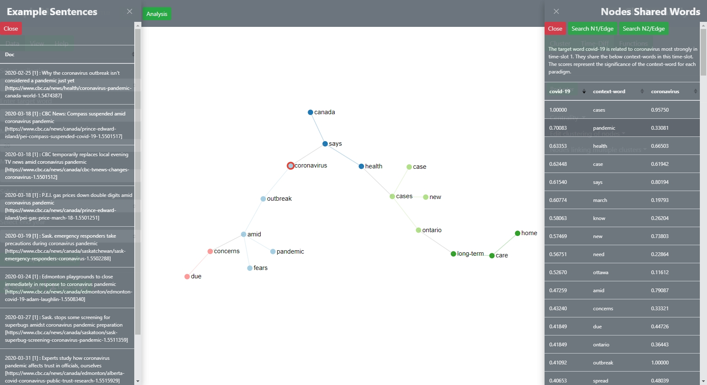
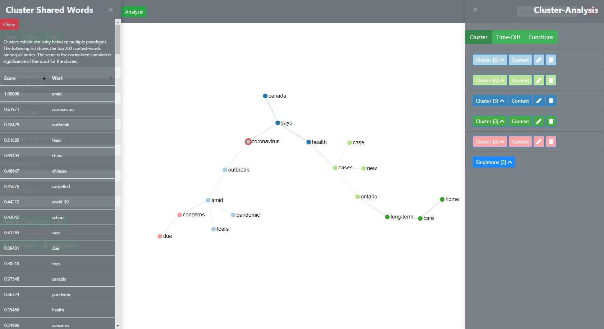

# NEW Context-Mining

SCoT Version 2 offers several new context-mining functions that enable a user to dig deeper into the underlying data. In order to understand these functions, one needs to briefly recapitulate the data-pipeline that feeds into SCoT.  
1. Text Data from Google Books and other sources is analysed with in the JoBim-Framework with a specific holing operation such as Dependency Parsing that operates (most often) on sentence level. JoBim thus determines a number of context words [ie. features] for each word. These context words are ranked according to significance.
2. Based on these syntagmatic feature-vectors, the semantic similarity between paradigms is calculated. The max similarity score is 1000. The lowest score is 0. 
3. The semantic metrics per time-slice are used to construct the graph.

In order to understand the graph and the clusters and to find good examples for research, the user can go back the data-[con]text-pipeline and "mine" it. Thus, by clicking on a node or edge, the software brings up the information on the semantic similarity metric per time-slice. Further, it brings up a list of context-words that characterize and underpin the semantic relationship. Their significances are normalized in order to allow good comparisons. 

## Node-Context
The context of a node is determined by the relationship between the target word and the paradigm that is represented by the node.
The following feature-vector list shows that the relationship between happiness/NN [target word] and satisfaction/NN [paradigm-node] is largely determined by their shared antidote misery/NN which often occurs in a or-conjunction in sentences in Google Books.

The information can be further traced back to the original sentences in which the paradigm and its context-words cooccured. The following pictures shows example sentences that have been analysed for the demo-corpus Corona-News [based on Canadian news websites]. In order to bring up these sentences, the user needs to choose a word from the table - thus select a row - and then click the green button on top of the slider Nodes Shared Words which searches for the combination of the node-word, such as corona, and the selected context word. The following example shows sentences that contain the words coronavirus[paradigm] and the word pandemic [selected context word]

## EDGES
The same function can be used for edges. The user can click on an edge and a similar window will slide out which also enables context-mining.

## Clusters

The user can also garner context-information for each cluster by clicking on the context-button in the cluster-analysis view. Clusters exhibit similarity between multiple paradigms. The resulting list shows the top 200 context-words among all nodes of the selected cluster. The displayed score is the normalized cumulated significance of the word for the cluster. 

