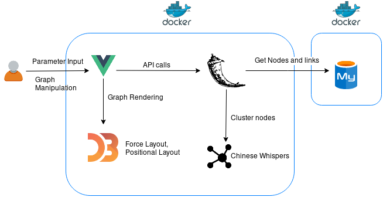

# Installation Guide

This guide is designed to help you run SCoT on your own server or local machine. You can either run it in Docker or just directly on your computer.

## Installation with Docker
Just clone the repository from GitHub.

```
$ git clone git@github.com:uhh-lt/SCoT.git
```

In the SCoT/ directory type
```
$ docker-compose up
```
into your console and the whole thing should be running.

## Configuring the Database with Docker
For test purposes you can use the dump.sql in the db/ directory as your database.
For this, provide this file as an entrypoint for Docker database in the `docker-compose.yml` and provide a directory in which the Docker volume will be stored on your local machine (here it's ./db/data).
```yaml
 db:
    image: mariadb:10.4.6
    volumes:
      - ./db/dump.sql:/docker-entrypoint-initdb.d/dump.sql
      - ./db/dev_data:/var/lib/mysql
    environment:
      MYSQL_ROOT_PASSWORD: ROOT_PASSWORD
      MYSQL_DATABASE: DATABASE
      MYSQL_USER: USER
      MYSQL_PASSWORD: PASSWORD
    networks:
      scot-net:
```
Your config.json should look like this:
```json
{
	"host" : "0.0.0.0",
	"database" : "mysql://USER:PASSWORD@db/DATABASE"
}
```
Feel free to connect your own database to SCoT. Make sure to follow the [`schema.sql`](https://github.com/uhh-lt/SCoT/blob/master/Utility_Files/schema.sql) when creating your database.

<!--One trick to create a dump.sql is to build an SQL file yourself identical to the provided dump.sql, if your data - like mine - is distributed across multiple databases. You can then use that SQL file as an entrypoint for Docker and create a new volume from it.
-->

## Installation without Docker
You can also run SCoT locally on your machine. This is especially nice for development purposes. Install the `requirements.txt` via `pip` on your computer or create a venv to run SCoT in and only install the dependencies there. Navigate to the directory `/src_vue` and start SCoT by entering `python scot.py` into your command line. You can view it in a browser under `0.0.0.0:5000`.

## Configuring the Database without Docker
You can specify your local MySQL database via the config.json. This is my config.json for connecting to my local development database:
```json
{
	"host" : "0.0.0.0",
	"database" : "mysql://USER@0.0.0.0/DATABASE"
}
```

## Creating a Database
In order for your database to work with SCoT it needs to follow a certain shema:
```sql
DROP DATABASE IF EXISTS scot;
CREATE DATABASE scot;

USE scot;

DROP TABLE IF EXISTS similar_words;
CREATE TABLE similar_words (
  word1 varchar(64) NOT NULL,
  word2 varchar(64) NOT NULL,
  score int(10) unsigned NOT NULL,
  time_id int(10) unsigned NOT NULL) ENGINE=MyISAM DEFAULT CHARSET=utf8;

DROP TABLE IF EXISTS time_slices;
CREATE TABLE time_slices (
    id INT UNSIGNED NOT NULL,
    start_year SMALLINT UNSIGNED NOT NULL,
    end_year SMALLINT UNSIGNED NOT NULL
)ENGINE=MyISAM DEFAULT CHARSET=utf8;

CREATE INDEX word1_idx ON similar_words(word1);
CREATE INDEX word2_idx ON similar_words(word2);
CREATE INDEX time_id_idx ON similar_words(time_id);
```

As for the data: you need collocations of the target word and the collocations of the target word's collocations. You also need time slices for when these collocations occur as well as a score (e.g. number of occurrance) between them. In the table "time_slices", the start and end years are integers like *1520*. A row in the "similar_words" table would look like this *('bahamas', 'crisis', 1, 5)*. 'bahamas' is word1, 'crisis' is word2, '1' is the score between them and '5' is the id for the time slice the pair occurs in. For an edge to appear in the graph between *bahamas* and another node, there needs to be an entry with *bahamas* as word2 and the other node as word1 or vice versa.

## Some Remarks on the Tech Stack

In the image below you can see the overall architecture of SCoT.




For rendering and manipulating the graph in the frontend I use D3.js in combination with Vue.js. 

[D3.js (Data Driven Documents)](https://d3js.org/) is a JavaScript library for creating custom interactive visualizations through direct manipulation of DOM elements. It provides methods to bind data to the DOM and many different ways to manipulate the DOM elements. For SCoT, I use a force simulation network to render the graph.

For building the user interface, I used the JavaScript framework [Vue.js](https://vuejs.org). It is incrementally adaptable and easy to get started with. Vue.js provides directives to reactively interact with the HTML, e.g. data entered via an input field can be directly modeled by or bound to JavaScript variables.
For styling the frontend I used [Bootstrap-Vue](https://bootstrap-vue.js.org/), a Bootstrap version developed especially for the Vue.js framework.

The backend is implemented in Python and MySQL. For accessibility reasons I decided to use Python [records](https://github.com/kennethreitz/records) to query the database. Records is an easy-to-use library to access most relational database types. Since SCoT only queries the database, records is sufficient.
The REST API is implemented with [Flask](https://palletsprojects.com/p/flask/), a lightwight WSGI web application framework. For deploying the Flask app I use a combination of [uWSGI and nginx](https://github.com/tiangolo/uwsgi-nginx-flask-docker) in the Dockerfile.
To calculate the clusters in the graph, I apply the [Chinese Whispers](https://www.inf.uni-hamburg.de/en/inst/ab/lt/publications/2006-biemann-cw-textgraph.pdf) algorithm.

To calculate the similarities between words you can use e.g. [JoBimText](http://ltmaggie.informatik.uni-hamburg.de/jobimtext/).
