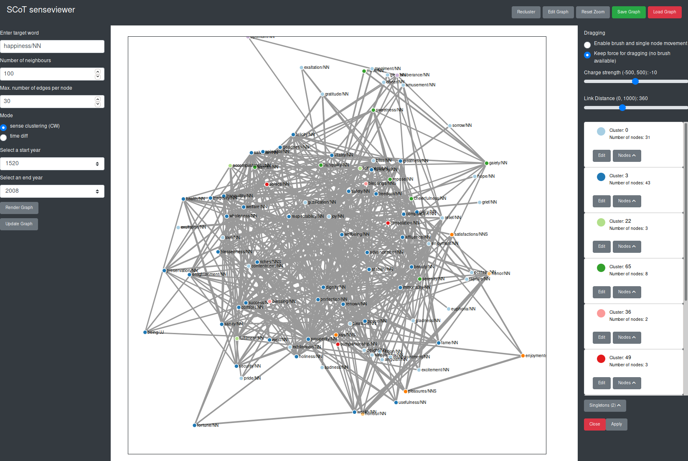
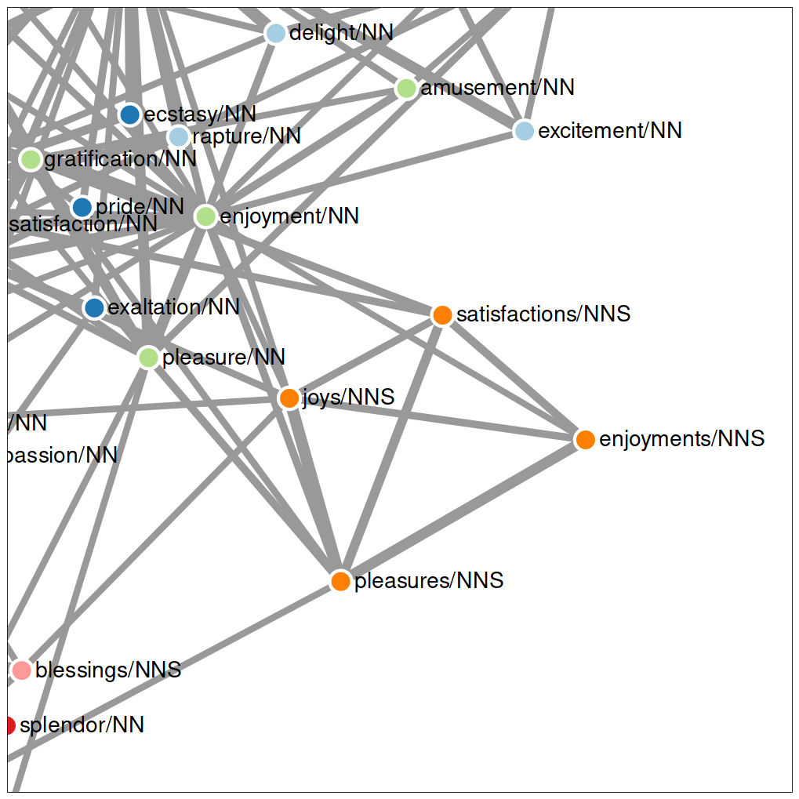
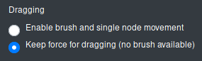
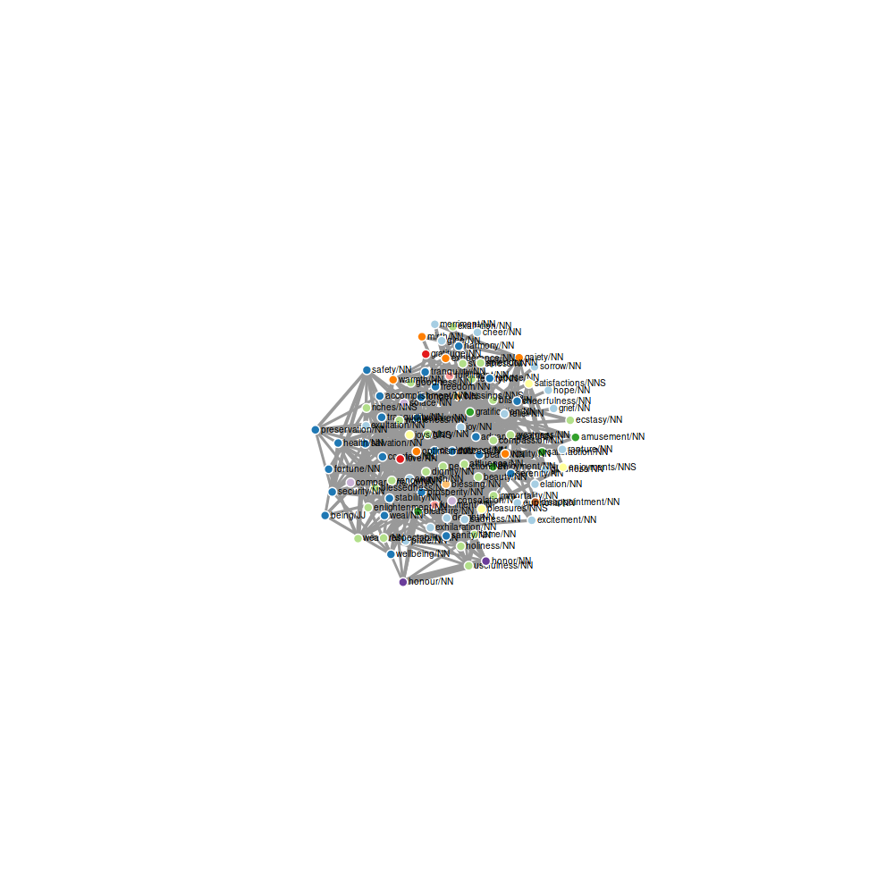
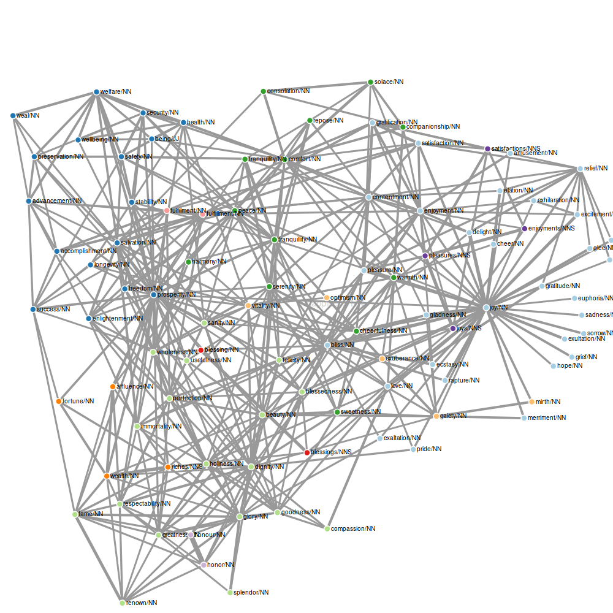
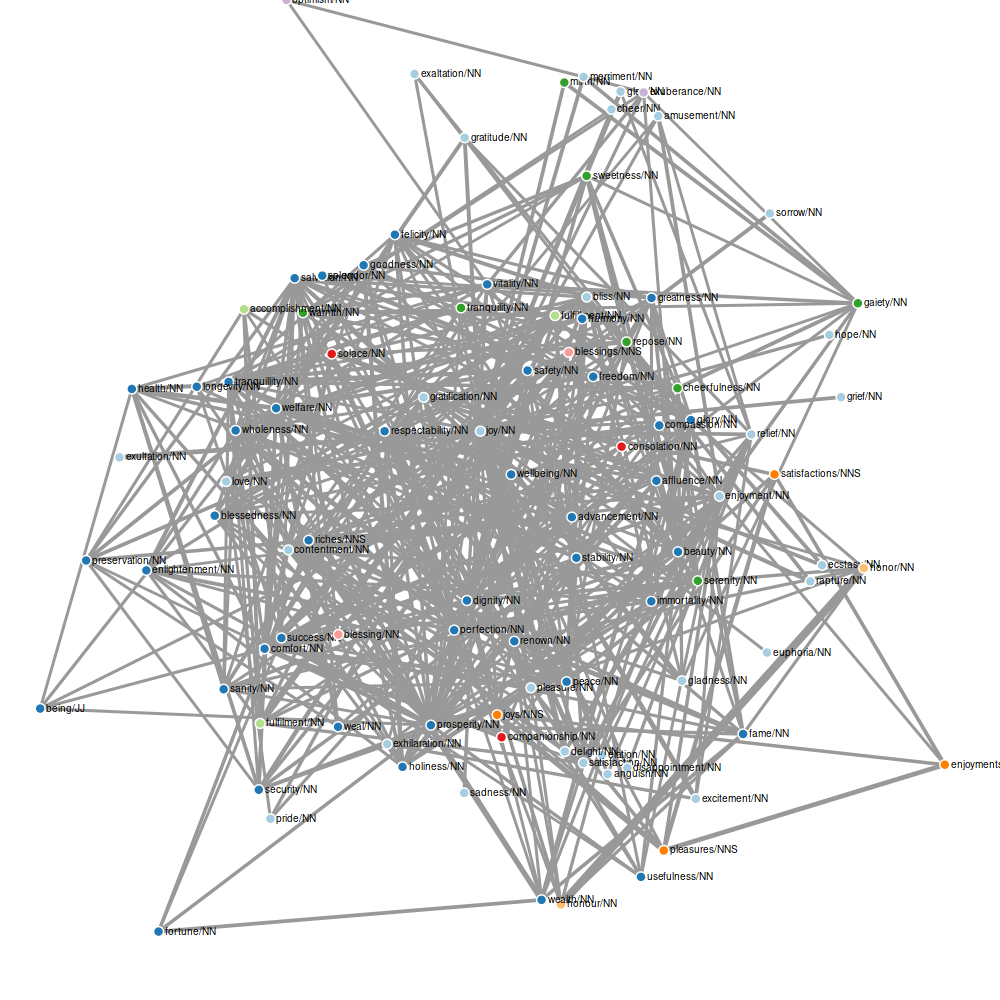
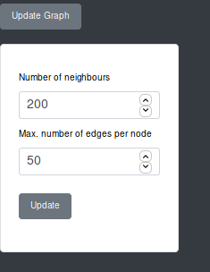

# Interacting with the Graph
There are many ways to interact with the graph, examine and manipulate it.
Most of the manipulation functionalities are only available in the sense clustering mode.
The functionality buttons are only faded in, if a graph is rendered.

By clicking on the button "Recluster", the clustering algorithm is executed on the graph again, potentially resulting in a different hypothesis.

Clicking on the "Edit Graph" button opens up a column to the right of the graph with options to edit and examine the graph.

The functionalities available in the edit column are explained in detail in the sections below. The edit column can be closed via the "Close" Button at the bottom.

The button "Reset Zoom" resets all the zooming and panning activity to 0. You can zoom into the graph by scrolling in the box with the graph and pan by pressing and the moving the cursor within the box.

The graph is rendered using a force simulation, which means that the positions of nodes are automatically calculated according to different parameters such as the charge between them.

## Reclustering
When clicking the button "Recluster" in the top right-hand corner, the clustering algorithm is executed on the graph again. This may result in different clusters, since the algorithm used is non-deterministic. This way, the user is able to see different hypothesis the system makes about the senses of the target word. For more information on the Chinese Whispers Clustering Algorithm click [here](http://delivery.acm.org/10.1145/1660000/1654774/p73-biemann.pdf?ip=77.20.250.85&id=1654774&acc=OPEN&key=4D4702B0C3E38B35%2E4D4702B0C3E38B35%2E4D4702B0C3E38B35%2E6D218144511F3437&__acm__=1568553032_2c17e0dabf68573cf049cc4c8c1491be).

## Editing the Graph
The user can edit different aspects of the graph, e.g. manipulate simulation parameters, add nodes, name clusters amongst others.

### Dragging Nodes
In the edit column the dragging behaviour of the nodes can be selected.

SCoT provides two different types of dragging behaviours for nodes. The default dragging behaviour is "Keep force for dragging (no brush available)".
Using this dragging behaviour, only one node at a time can be selected. The user selects a node by clicking on it. Then the selected node is marked with a red circle around it.

The selected node can then be moved to a different position through drag & drop. The nodes in the graph reposition themselves automatically according to the force simulation, as long as they have not been moved manually before. If a node as been dragged to a different position, it stays in that position, even if the simulation parameters are changed.

The other dragging behaviour is "Enable brush and single node movement". Using the dragging behaviour pauses the simulation, meaning you can select a node and drag it around without any other nodes following. You can also *brush* over several nodes to select them. To use the brush, hold down and drag the cursor, which opens up a box. All the nodes in this box are selected and can be dragged at the same time maintaining their exact positions to each other. To drag selected nodes, click on one of those nodes and drag it to its new position. The other nodes stay in the exact relative position to the dragged node.

### Manipulate the Simulation
SCoT lets you edit two simulation parameters: the charge strength between the nodes and the link distance.
The default value for the charge strength is -10, the default value for the link distance is 100.
A graph with 100 nodes, 30 edges and these simulation parameter values looks like this:

Changing the charge strength influences the repelling forces between the nodes. The same graph with a charge strength of -252 and the default link distance looks as follows:

As a rule of thumb, a negative charge strength pushes the nodes further apart, simulating repulsion, and a positive charge strength pushes nodes together, simulating gravity or attraction.

The link distance influences the distance between nodes and therefore the length of the edges between them. A high link distance means a long distance between nodes, a low link distance means a small distance between nodes. The following example shows and graph with a link distance of 360 and the default charge.

 

### Fade in Neighbours on Hover over Node
When hovering over a node in the graph only it and its neighbouring nodes as well as the edges between them are faded in. This way, the user can better explore the direct vicinity of a node.

### Add new Nodes to the Graph
The user can add new nodes to the graph via the "Update" button that is faded in beneath the "Render" button in the parameter input column as soon as a graph is rendered. Clicking on the button opens up a card, where the user can enter the number of nodes and the maximum number of edges per node in the updated graph. 

If the numbers are the same or less than the those in the graph that is to be updated no new nodes or edges are rendered. Otherwise the missing nodes and edges are added to the graph to match the input numbers when the user clicks on the button "Update".

The default number of updated nodes is 200, the default number of edges is 50.

**Note:** When updating the graph the previous clusters are lost, since the clustering algorithm is executed on the data again. Otherwise there would not be a cluster hypothesis for the newly added nodes.

If the nodes have been dragged beforehand they will stay in the position when adding new nodes to the graph. 