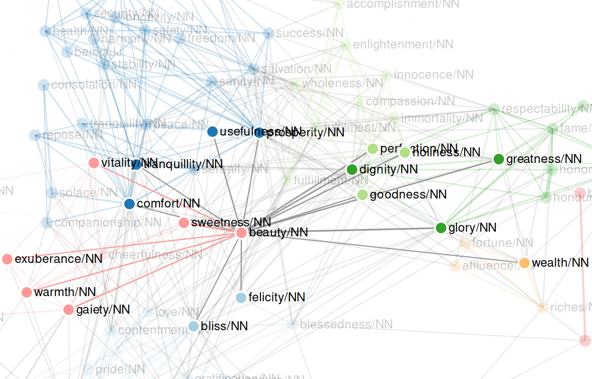
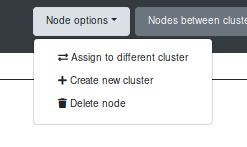
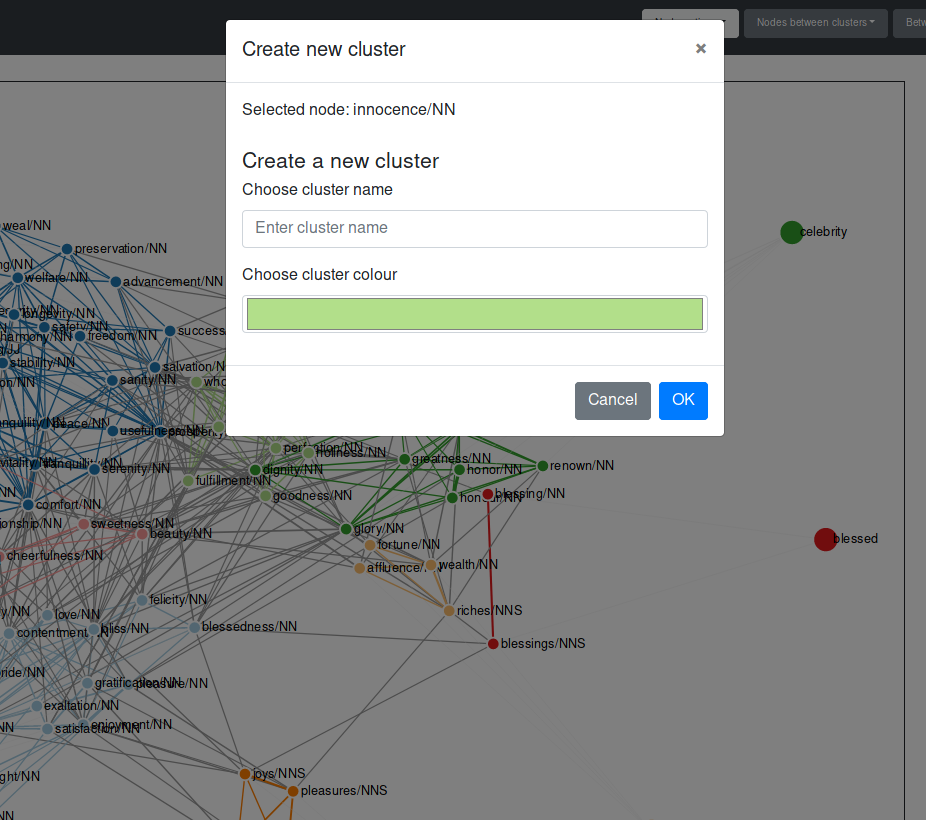

# Interacting with the Graph

[Back to user guide contents list](userGuide.md)

This section describes how the user can manipulate the graph directly.

## Contents

* [Hover over Nodes](#hover-over-nodes)
* [Dragging Nodes](#dragging-nodes)
* [The Node Options Menu](#the-node-options-menu)
	* [Assigning a Node to a Different Cluster](#asigning-a-node-to-a-different-cluster)
	* [Creating a New Cluster for a Node](#creating-a-new-cluster-for-a-node)
	* [Deleting a Node](#deleting-a-node)

## Hover over Nodes

When hovering over a node in the graph, only the node itself and its neighbouring nodes and the edges connecting them are faded in. This way, the user can explore the direct vicinity of a node more easily.

[To the top](#interacting-with-the-graph)

## Dragging Nodes

In the edit column, the dragging behaviour of the nodes can be selected.

SCoT provides two different types of dragging behaviours for nodes. The default dragging behaviour is "Keep force for dragging (no brush available)".
Using this dragging behaviour, only one node at a time can be selected. The user selects a node by clicking on it. Then the selected node is marked with a red circle around it.

The selected node can then be moved to a different position through drag & drop. The nodes in the graph reposition themselves automatically according to the force simulation, as long as they have not been moved manually before. If a node as been dragged to a different position, it stays in that position, even if the simulation parameters are changed.

The other dragging behaviour is "Enable brush and single node movement". Using the dragging behaviour pauses the simulation, meaning you can select a node and drag it around without any other nodes following. You can also *brush* over several nodes to select them. To use the brush, hold down and drag the cursor, which the opens up a kind of box. All the nodes in this box are selected and can be dragged at the same time maintaining their exact positions to each other. To drag multiple selected nodes, click on one of those nodes and drag it to its new position. The other nodes are moved simultaneously. Again, nodes that have been dragged are fixed to their position from then on.

With the button "Restart Simulation", the user can release all the fixed nodes.

[To the top](#interacting-with-the-graph)

## The Node Options Menu

When the user selects a node, a button "Options" is faded in in the navbar. When clicking on the "Options" button, a drop down menu opens with functions to manipulate the selected node. For normal nodes, there are three functions available to the user.

 1. Assigning the node to a different cluster
 2. Creating a new cluster and assigning the node to it
 3. Delete the node from the graph

[To the top](#interacting-with-the-graph)

### Assigning a Node to a Different Cluster
To support free editing of graphs for various purposes, users can assign nodes to a different existing cluster.

After selecting the option "Assign to different cluster", a modal is opened,  which shows the selected node, its current cluster, and an input field in which the user can enter the new cluster of the node.

On clicking "OK", the node's colour changes to the one of the newly assigned cluster. It also changes the cluster in the cluster list.

If cluster labels are used, they do not automatically update, but have to be deleted manually and reentered with the updated clusters via the edit function of the respective cluster.

[To the top](#interacting-with-the-graph)

### Creating a New Cluster for a Node

If the user does not agree with the cluster assignment of a node and does not feel that the node would fit into any of the other clusters, the user can create a new cluster for a node.
For this, the user selects the option "Create new cluster". The following modal is displayed to the user.

The selected node is displayed to the user, so that they can verify that they are working on the correct node. They can then choose a name for the new cluster as well as a colour. A colour picker displayed to the user after they have clicked on the coloured box for selecting a new colour.

After clicking the "ok" button in the modal, the new cluster is created. The node is coloured in the selected colour and its cluster changed. The cluster now appears in the cluster list in the edit sidebar. Other nodes can also be assigned to the newly created cluster via the function "Assign to different cluster".

[To the top](#interacting-with-the-graph)

## Deleting a Node
A selected node in the graph and the links connecting it to any of the nodes in the graph can deleted via the "Delete node" function in the node options menu. This applies for both normal word nodes as well as cluster nodes. 

Cluster labels can also be deleted via selecting them (clicking on them) and then pressing `BACKSPACE`.

**Note of caution:** Currently, selected cluster nodes are always deleted when pressing `BACKSPACE`. So please check, if any cluster nodes are selected beforehand!

[To the top](#interacting-with-the-graph)