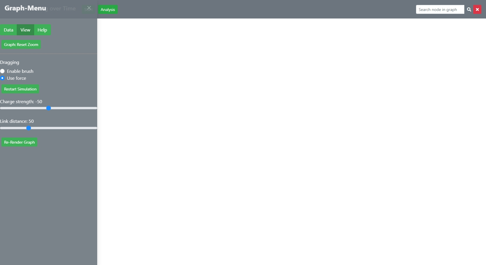
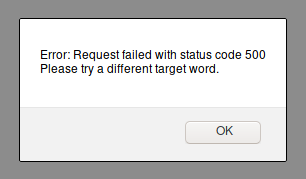

# Parameter Input and General Settings

[Back to user guide contents list](userGuide.md)

A sidebar to change the general settings of SCoT and enter the parameters for rendering and updating a graph is located to the left side of the page.

## Content

* [Rendering a Graph from the Database](#rendering-a-new-graph-from-the-database)
* [Rendering a Graph from a File](#rendering-a-graph-from-a-file)

## Parameter Input for Rendering a Graph
When the user first opens SCoT, they may either render a new graph by entering the required parameters in the left column or they can load a previously stored graph again from a file.

The image shows a new session.

[To the top](#parameter-input-and-general-settings)

### Rendering a New Graph from the Database

If the user wants to render a new graph from the database, he or she needs to specify some parameters.  
  
Firstly, there are parameters that affect the data-basis, content, time-context and structure of the graph
(1) The user needs to pick a database. This brings up several presets for the other settings-options which can be modified by the user.   
(2) The user needs to choose a target word. 
(3) The user needs to be specify how many nodes the graph should contain (a.k.a. "Number of neighbours"), as well as the maximum number of edges on a node. default, the number of neighbours is set to 100 (regulating the number of visible paradigms) and the maximum number of edges per paradigm is set to 30 (regulating the density of the graph, smaller numbers result usually in more clusters).  
(4) The user needs to set the start and end years for the time-slice-interval analysis. Per default, this is set to encompass all the time slices (1520 - 2008 for Google Books).   
  
Secondly, the user can set display settings, including  
(5) resetting to the preset-display settings
(6) Enabling interaction with the full graph or parts of it
(7) Further, the graph is displayes using a force-directed algorithm. The strength of the force can be altered and the distance between nodes.  

<!-- Leave note -->
**Note:** For the Google Books data, the respective part-of-speech tag needs to be appended to the query word. The correct query word for “crisis” would therefore be “crisis/NN” or “crisis/NNP”. The data uses the [Penn Treebank POS tags](https://www.ling.upenn.edu/courses/Fall_2003/ling001/penn_treebank_pos.html). Other data might have different tags, or none.

If the user enters a target word, for which there is no match in the database, they will recieve the following alert.

[To the top](#parameter-input-and-general-settings)

### Rendering a Graph From a File

A graph can also be rendered from a file. 

[To the top](#parameter-input-and-general-settings)

