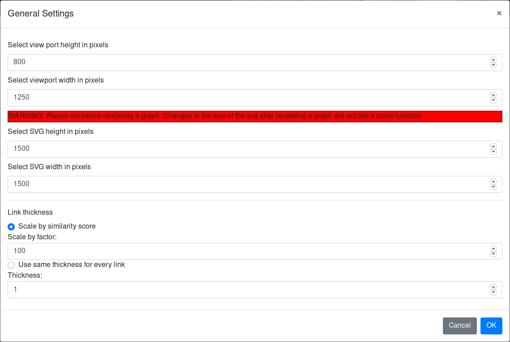
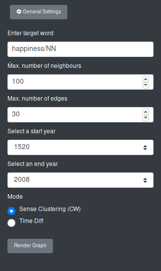
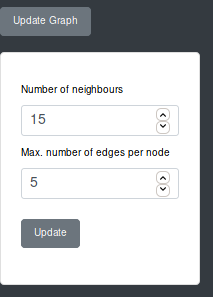

# Parameter Input and General Settings

A sidebar to change the general settings of SCoT and enter the parameters for rendering and updating a graph is located to the left side of the page.

[General Settings](#general-settings)

[Rendering a Graph from the Database](#rendering-a-new-graph-from-the-database)

[Rendering a Graph from a File](#rendering-a-graph-from-a-file)

[Update a Graph](#update-a-graph)

## General Settings

{:height="75%" width="75%"}

Via the general settings the user can change the size of the viewport as well as the size of the SVG of the graph. The latter should be done before the graph is rendered, otherwise it will only act as a zoom function, without allowing the graph more room on the SVG. The default viewport is 550 x 950 pixels. The default SVG size is 1500 x 1500 pixels.

The user can also decide how the link thickness should be calculated. It can either be scaled depending on the similarity score between nodes or it can be set as an absolute pixel value.
If the user wishes to scale the link thickness with respect to the similarity the nodes it connects, the thickness is calculated as **sqrt(similarity_score / factor)**. The user can set the variable *factor*.

[To the top](#parameter-input-and-general-settings)

## Parameter Input for Rendering a Graph
When the user first opens SCoT, they may either render a new graph by entering the required parameters in the left column or they can load a previously stored graph again from a file.

The image shows a new session.

[To the top](#parameter-input-and-general-settings)

### Rendering a New Graph from the Database

If the user wants to render a new graph from the database, he or she needs to specify some parameters.

{:height="75%" width="75%"}

First, the user needs to enter a target word.

**Note:** For all words the respective part-of-speech tag needs to be appended to the query word. This is due to disambiguation purposes. The correct query word for "crisis" would therefore be "crisis/NN" or "crisis/NNP" (the latter is currently not contained in the database, since the target words are limited to the ones listed above). The data uses the [Penn Treebank POS tags](https://www.ling.upenn.edu/courses/Fall_2003/ling001/penn_treebank_pos.html).

Secondly, the user needs to be specify how many nodes the graph should contain (a.k.a. "Number of neighbours"), as well as the maximum number of edges on a node. Per default the number of neighbours is set to 100 and the maximum number of edges is set to 30.

Last but not least, the user has to specify the time period in which the collocations should occur. Per default this is set to encompass all the time slices (1520 - 2008).

Another parameter is the mode. However, a graph is always rendered in the sense clustering mode, so I recommend to just leave it as it is when rendering a new graph. The "Time Diff" mode is described in a separate [section](timeDiff.md).

[To the top](#parameter-input-and-general-settings)

### Rendering a Graph From a File

See [the functions of the navbar](navbar.md) for more information

[To the top](#parameter-input-and-general-settings)

### Updating a Graph

The user can change the number of nodes and edges in a rendered graph. This can be done via the "Update" function. The user can specify the desired values and change the graph, without starting a new session. However, the cluster will be different after updating the graph, because the clustering algorithm is currently executed anew.

[To the top](#parameter-input-and-general-settings)