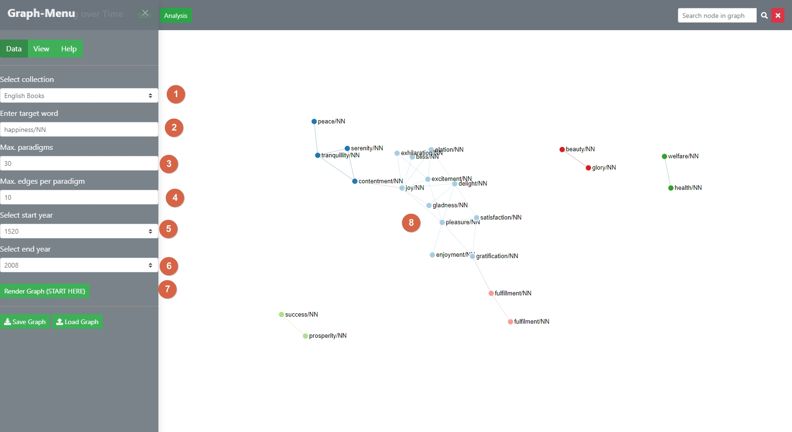

# Graph-Menu: Parameter Input and View Settings

[Back to user guide contents list](userGuide.md)

A sidebar to change the general settings of SCoT and enter the parameters for rendering and updating a graph is located to the left side of the page.

## Content

* [Rendering a Graph from the Database](#rendering-a-new-graph-from-the-database)
* [Rendering a Graph from a File](#rendering-a-graph-from-a-file)

## Parameter Input for Rendering a Graph
When the user first opens SCoT, it is recommended to click the START-button which brings up the graph-menu. The graph menu allows either to shape a new graph (as explained on the last page) OR to load and save a calculated graph. 

Secondly, the user can set display settings, including  
- resetting to the preset-display settings
- Enabling interaction with the full graph or parts of it
- Further, the graph is displayes using a force-directed algorithm. 

The user can decide between two different dragging behaviours, as well as influence parameters of the force simulation, which is used to calculate the position of the nodes in the graph. For more information on how to manipulate the graph directly, see [the section on interacting with the graph](interacting.md).

## Choosing the Dragging Behaviour

The user can select between two different kinds of dragging behaviour.

1. **Enable brush (no force).** This enables to user to select multiple nodes at the same time using a brush movement and dragging all of them at the same time to a different position. The force is not acitve, so that the other nodes to not reposition themselves.
2. **Use force (no brush available).** This is the default dragging behaviour. Only one node can be dragged at a time and the other nodes reposition themselves according to the force simulation. The dragged node is then fixed to its new position, which means that its position does not change if the force parameters are updated or other nodes dragged somewhere.

All the nodes that are fixed to their position can be released by clicking on the button "Restart Simulation".

For how to drag nodes in the graph, see [the section on interacting with the graph](interacting.md).

[To the top](#editing-the-graph-via-the-functions-of-the-editing-sidebar)

## Manipulate the Simulation

SCoT lets you edit two simulation parameters: the charge strength between the nodes and the link distance.
The default value for the charge strength is -50, the default value for the link distance is 50.
A graph with 100 nodes, 30 edges and these simulation parameter values looks like this:

{:height="75%" width="75%"}

The use can change the value of the charge strength from values in the range of -200 to 100. Changing the charge strength influences the repelling forces between the nodes. The same graph with a charge strength of -100 and the default link distance looks as follows:

As a rule of thumb, a negative charge strength pushes the nodes further apart, simulating repulsion, and a positive charge strength pushes nodes together, simulating gravity or attraction.

The link distance influences the distance between nodes and therefore the length of the edges between them. A high link distance means a long distance between nodes, a low link distance means a small distance between nodes. The following example shows and graph with a link distance of 150 and the default charge.

 

[To the top](#parameter-input-and-general-settings)

<!-- Leave note -->
**Note:** For the Google Books data, the respective part-of-speech tag needs to be appended to the query word. The correct query word for “crisis” would therefore be “crisis/NN” or “crisis/NNP”. The data uses the [Penn Treebank POS tags](https://www.ling.upenn.edu/courses/Fall_2003/ling001/penn_treebank_pos.html). Other data might have different tags, or none.

If the user enters a target word, for which there is no match in the database, they will recieve the following alert.

[To the top](#parameter-input-and-general-settings)

### Rendering a Graph From a File

A graph can also be rendered from a file. 

[To the top](#parameter-input-and-general-settings)

