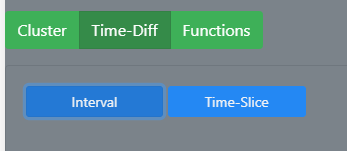

# Time Diff Mode

[Back to user guide contents list](userGuide.md)

When selecting "time diff" mode in the cluster-analysis sidebar on the right-hand side, two options are presented: "Interval" and "Time-Slices".

When in this mode, some functionalities are disabled, such as saving the graph [it requires saving with the original cluster colors].

## Select Interval

With the option "Select Interval" the user can select a specific time interval within the time period selected for the graph and compare the smaller interval to the larger one.

In the example from Google Books data below, the interval from 1954 to 1974 is selected. Nodes that do not occur before 1520 and 1954 are categorized as *born* (green nodes), since they start to occur somewhere within the selected period. Nodes that do not occur between 2001 and 2008 are classified as *deceased* (red nodes), since they stop occurring within the the selected time period. Words that start and stop occurring within the selected time period are categorized as *shortlived* (yellow nodes). All other nodes occur consistently (grey nodes). Hovering over the button shows the nodes in the graph.

All the nodes of a category are listed when the user clicks on the button. When the user hovers over the main time-category button such as "Died before interval"  the nodes belonging to this category are faded in in the graph.

In the graph, the nodes are coloured accordingly. The previous cluster colours are still visible in the edit graph column. 

To regain the cluster colours in the graph switch back to sense clustering mode.

## Skip through time slices

With the "Skip through time slices" option, you can look at each time slice of your originally selected time period of the graph individually. You can either use it directly when switching from the sense clustering mode or after changing the colour of the nodes via the "Select Interval" option. 

**Note:** The "Select Interval" functionality and the "Skip through time slices" functionality are independent of each other.